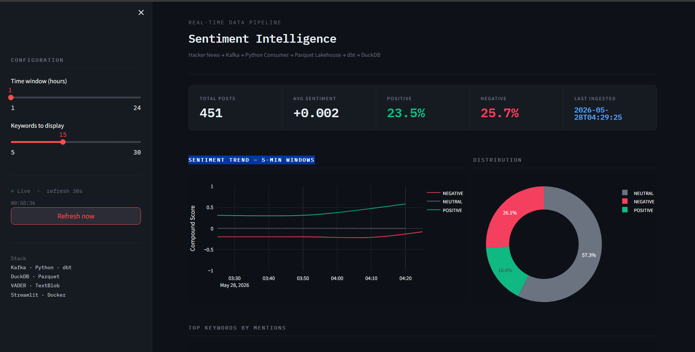
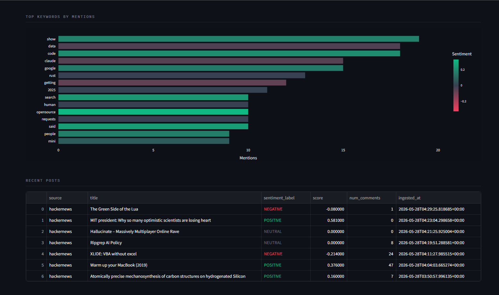

# Sentiment Intelligence Pipeline

A production-grade, end-to-end real-time data engineering project that ingests live posts from Hacker News, enriches them with NLP sentiment analysis, stores them in a Parquet medallion lakehouse, transforms with dbt, and surfaces insights on a live dashboard.

**Zero paid APIs. Fully open-source.**




---

## Architecture

```
Hacker News Public API
        │
        ▼
  Kafka Producer (Python)
  · idempotent keys · gzip compression · dead-letter queue
        │
        ▼
  Apache Kafka  (Docker)
  topic: raw-posts  (3 partitions)
  topic: dead-letter-queue
        │
        ▼
  Python Consumer
  · VADER + TextBlob ensemble sentiment enrichment
  · Bronze → Silver Parquet write (partitioned by source / date)
        │
        ▼
  Parquet Data Lake  (local filesystem)
  ├── Bronze/  raw JSON bytes, append-only
  └── Silver/  cleaned, schema-enforced, sentiment-enriched
        │
        ▼
  dbt + DuckDB
  · stg_posts (Silver view)
  · sentiment_trends (Gold table — 5-min windowed aggregations)
  · topic_leaderboard (Gold table — keyword frequency + sentiment)
        │
        ▼
  Streamlit Dashboard
  · KPI cards · sentiment trend chart · distribution donut
  · top keywords bar chart · recent posts table
  · live auto-refresh every 30 seconds
        │
        ▼
  Apache Airflow  (Docker)
  · orchestrates dbt run every 15 minutes
  · Kafka health checks · data quality gates
```

---

## Tech Stack

| Layer | Technology | Purpose |
|---|---|---|
| Message broker | Apache Kafka (Docker) | Decouple producer and consumer, replay, backpressure |
| Producer | Python + kafka-python | Pull live HN stories, publish to Kafka |
| AI enrichment | VADER + TextBlob | Ensemble sentiment scoring, zero latency, zero cost |
| Storage | Parquet (local) | Columnar, compressed, schema-evolvable data lake |
| Transformation | dbt-core + dbt-duckdb | Medallion layer modeling, tested SQL transformations |
| Warehouse | DuckDB | Columnar OLAP engine, reads Parquet natively |
| Orchestration | Apache Airflow (Docker) | DAG scheduling, health checks, alerting |
| Dashboard | Streamlit + Plotly | Live visualization of Gold layer metrics |
| Infrastructure | Docker Compose | One-command local setup |

---

## Medallion Architecture

| Layer | Format | Trigger | Contents |
|---|---|---|---|
| Bronze | Parquet | Every poll | Raw JSON, append-only, no transforms |
| Silver | Parquet | Every poll | Cleaned, deduplicated, sentiment-enriched |
| Gold | DuckDB tables | Every 15 min (Airflow) | Aggregated metrics, windowed trends |

---

## Setup

### Prerequisites

- Python 3.9+
- Docker Desktop (running)
- Java 11 (optional — only needed if using the original Spark consumer)

### Windows

```powershell
Set-ExecutionPolicy -Scope Process -ExecutionPolicy Bypass
.\scripts\setup.ps1
```

### Mac / Linux

```bash
chmod +x scripts/setup.sh
./scripts/setup.sh
```

### Start the pipeline

Open four terminals from the project root:

```bash
# Terminal 1 — Producer
source .venv-producer/bin/activate     # Windows: .\.venv-producer\Scripts\Activate.ps1
python producer/hn_producer.py

# Terminal 2 — Consumer
source .venv-consumer/bin/activate
python consumer/spark_consumer.py

# Terminal 3 — dbt (run after ~1 min of data)
source .venv-dbt/bin/activate
cd dbt && dbt run --profiles-dir .

# Terminal 4 — Dashboard
source .venv-dashboard/bin/activate
streamlit run dashboard/app.py
```

| Service | URL |
|---|---|
| Live Dashboard | http://localhost:8501 |
| Airflow | http://localhost:8080 (admin / admin) |
| Kafka UI | http://localhost:8090 |

---

## Sentiment Model

Two models run in ensemble on every post title + body:

**VADER** (Valence Aware Dictionary and sEntiment Reasoner)
- Rule-based, designed for social media text
- Handles slang, punctuation emphasis, ALL CAPS
- Sub-millisecond latency per document

**TextBlob** (Naive Bayes)
- ML-based, better on formal longer-form text
- Provides subjectivity score (factual vs opinionated)

**Ensemble logic:**
```
compound   = 0.6 × vader_compound + 0.4 × textblob_polarity
confidence = signal_magnitude × (1 if models agree else 0.5)
label      = MIXED if models strongly disagree, else POSITIVE / NEGATIVE / NEUTRAL
```

**Why not an LLM API?**
At 500+ posts/hour, a GPT-4 call per post would cost ~$15–50/day and add 500–2000ms latency per record. VADER scores a document in under 1ms with no network dependency.

---

## Project Structure

```
realtime-streaming-ai/
├── producer/
│   ├── hn_producer.py          Hacker News API → Kafka (no auth required)
│   └── reddit_producer.py      Reddit public JSON → Kafka
├── consumer/
│   ├── spark_consumer.py       Kafka → Bronze/Silver Parquet
│   └── sentiment_enricher.py   VADER + TextBlob ensemble
├── dbt/
│   ├── models/silver/
│   │   └── stg_posts.sql       Staging view over Silver Parquet
│   └── models/gold/
│       ├── sentiment_trends.sql     5-min windowed aggregations
│       └── topic_leaderboard.sql    Keyword frequency + sentiment
├── airflow/dags/
│   └── pipeline_dag.py         Full orchestration DAG
├── dashboard/
│   └── app.py                  Streamlit live dashboard
├── scripts/
│   ├── setup.sh                Mac/Linux setup
│   ├── setup.ps1               Windows setup
│   └── run_pipeline.ps1        Windows one-command start
└── docker-compose.yml          Kafka + Zookeeper + Kafka UI + Airflow
```

---

## Deployment

### Cloud (AWS)

| Local component | AWS equivalent |
|---|---|
| Kafka (Docker) | Amazon MSK |
| Python Consumer | ECS Fargate task |
| Parquet on disk | S3 data lake |
| DuckDB | Amazon Athena or Redshift Spectrum |
| Airflow (Docker) | Amazon MWAA |
| Streamlit | ECS + ALB or EC2 |

### Cloud (GCP)

Kafka → Pub/Sub · Parquet → GCS · DuckDB → BigQuery · Airflow → Cloud Composer

### Streamlit Community Cloud (free)

1. Push to GitHub
2. Go to [share.streamlit.io](https://share.streamlit.io)
3. Connect repo, set main file to `dashboard/app.py`
4. Note: requires the DuckDB file to be accessible — use a shared GCS/S3 path or pre-seeded file

---

## Architecture Decisions

**Why Kafka over direct API → consumer?**
Kafka decouples producers and consumers. If the consumer goes down, messages are retained and replayed from the committed offset. Direct connection means lost data during downtime.

**Why Parquet for Bronze/Silver?**
Columnar storage means analytical queries read only the columns they need. Snappy/gzip compression achieves 5–10x size reduction. Parquet is the de-facto standard for data lakes (Delta Lake, Iceberg, Hudi all use it).

**Why DuckDB over PostgreSQL for Gold?**
DuckDB is an embedded columnar OLAP engine that reads Parquet natively without a server. For analytical queries on millions of rows it is typically 10–100x faster than row-oriented Postgres.

**Dead-letter queue pattern**
Any message that fails enrichment is routed to `dead-letter-queue` instead of crashing the consumer. This is a production reliability requirement — one malformed record must not halt the stream.

---

## Sample Output

```
title                                              sentiment    score
I'm Tired of Talking to AI                         NEGATIVE    -0.4242
Atomically precise mechanosynthesis of carbon...   POSITIVE    +0.1600
Justice Dept. Opens Criminal Inquiry               NEGATIVE    -0.0800
Training our own AI models                         POSITIVE    +0.2400
Show HN: I made an emergency page for my family    POSITIVE    +0.1700
Claude Code as a Daily Driver                      NEUTRAL      0.0000
```

---

## License

MIT
